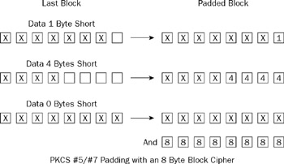

# Padding方法
## pkcs#5/pkcs#7


注意pkcs#5的分组长度为8bytes，pkcs#7的分组长度不定

aes使用这种padding模式


## MD5 padding

```
append "1" bit to message
append "0" bits until message length in bits ≡ 448 (mod 512)
append bit length of message as 64-bit little-endian integer to message
```

64字节一分组

（如果明文以字节为单位）计算明文bit长度（byte长度*8），转化为64位小段序，作为长度标记。在明文后先补上一位`\x80`，如果本组剩余长度少于8则再加一组，在最后一组的最后把8bytes记录长度标记，剩余部分用`\x00`填充

