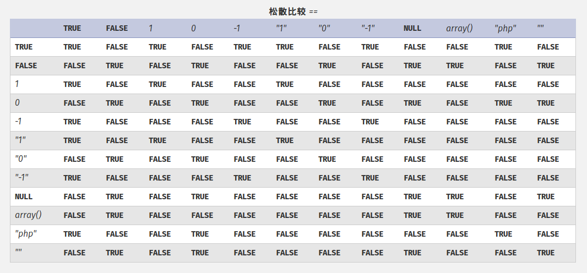

# PHP相关

php是最好的语言！

## PHP弱类型


* `var_dump('0xABCdef' == ' 0xABCdef');`
    * true (Output for hhvm-3.18.5 - 3.22.0, 7.0.0 - 7.2.0rc4: false)
* `var_dump('0010e2' == '1e3’);`
    * true
* `strcmp([],[])`
    * 0
* `sha1([])`
    * NULL
* `'123' == 123`
* `'abc' == 0`
* `'0x01' == 1`
    * PHP 7.0后，16位字符串不在当成数字（`'0x01 != 1'`）
* `0 == '' == false == NULL`
* `$a = 'a'`
    * `++$a` =>`'b'`
    * `$a+1` => 1

## PHP 全局变量
- `$_GET`会对传入的数据进行URLdecode
- `$_SERVER['REQUEST_URI']`和`$_SERVER['QUERY_STRING']`则是直接返回

## PHP函数特性
### intval
* 四舍五入(不存在的截断)
    * `var_dump(intval('5278.78'))` => 5278
* `intval(012)` => 10
* `intval("012")` => 12

### extract
`#!php int extract ( array &$array [, int $flags = EXTR_OVERWRITE [, string $prefix = NULL ]] )`

提取出数组中的键值，覆盖进变量

* `.php?_SESSION[name]=admin` 将admin覆盖入session

### trim
`#!php string trim ( string $str [, string $character_mask = " \t\n\r\0\x0B" ] )`

* 去掉字符串前后空白字符
- 默认去掉以下字符
    - `" "` (0x20)
    - `"\t"` (0x09)
    - `"\n"` (0x0A)
    - `"\x0B"` (0x0B)
    - `"\r"` (0x0D)
    - `"\0"` (0x00)
- 可以默认不包含`"\f"` (0x0C)
    - 比较：is_numeric()允许`\f`在开头

### in_array
`#!php bool in_array ( mixed $needle , array $haystack [, bool $strict = FALSE ] )`

- 默认使用松散比较
- 判断值是否在数组中而不是键是否在数组中

### array_search
`#!php mixed array_search(mixed $needle , array $haystack [, bool $strict = false ])`

与in_array类似，成功返回index，失败返回FALSE

### parse_str
`#!php void parse_str ( string $encoded_string [, array &$result ] )`

* 变量覆盖，与extract类似，传入的是urlencode过的字符串，传入指定数组，指定数组未设置，会覆盖全局变量
* 变量名中有` `（空格）或`.`（点），会被替换成`_`（下划线）


### parse_url

- 在处理URL时会有问题
- `parse_url('/a.php?id=1')`
    
    ```
    array(2) {
      ["host"]=>
        string(5) "a.php"
      ["query"]=>
        string(4) "id=1"
    }
    ```
- `parse_url('//a/b')`
    - host: `a`
- `parse_url('..//a/b/c:80')`
    - host: `..`
    - port: `80`
    - path: `//a/b/c:80`
- `parse_url('///a.php?id=1')`
    - false

- `parse_url('/a.php?id=1:80')`
     - PHP < 7.0.0
         - `false`
     - PHP >= 7.0.0
       ```
         array(2) { 
             ["path"]=> string(6) "/a.php" 
             ["query"]=> string(7) "id=1:80" 
         }
       ```

- `parse_url('http://kaibro.tw:87878')`
    - 5.3.X版本以下
        ```php
        array(3) { 
            ["scheme"]=> string(4) "http" 
            ["host"]=> string(9) "kaibro.tw" 
            ["port"]=> int(22342) 
        }
        ```
    - 其他： false


### preg_replace

- `mixed preg_replace ( mixed $pattern , mixed $replacement , mixed $subject [, int $limit = -1 [, int &$count ]] )`
    - 搜寻`$subject`中匹配的`$pattern`，并用`$replacement`替换
- 第一个参数用`/e`修饰符，`$replacement`会被当成PHP code执行
    - 必须有匹配到才会执行
    - PHP 5.5.0起，會產生`E_DEPRECATED`错误
    - PHP 7.0.0不再支援，用`preg_replace_callback()`代替

example:

``` php
<?php
$a='phpkaibro';
echo preg_replace('/(.*)kaibro/e','\\1info()',$a);
```
### sprintf/vprintf
打印格式：

1. `%`标志这一个格式化位置的起点
1. `[num]$`选择第`[num]`个参数
2. `+`或`-`强制显示符号（默认显示负号，忽略正号）(可选)
3. `0`或`'[char]`以0或者`[char]`作为填充字符，默认为空格（可选）
4. 数字，规定打印宽度（可选）
5. `.[num]`指定数字打印精度；如果是字符串，设置最大打印长度
6. 打印类型
    * `%` 转义的%
    * `b` 将整数打印为二进制
    * `c` 将整数打印成ASCII对应的字符
    * `d` 将整数打印成有符号十进制数
    * `e` 将数字打印科学计数法(1.2e+2)
    * `E` 同上(1.2E+2)
    * `f` 将浮点数打印为浮点数
    * `g` `%e`的简短版本
    * `G` `%E`的简短版本
    * `o` 将整数打印为八进制
    * `u` 将整数打印为无符号十进制整数
    * `x` 将整数打印为十六进制数（小写）
    * `X` 将整数打印为十六进制数（大写）

可能利用的特性：

- 如果存在上述格式化字符中不存在的字符则忽略不处理
### addslashes:
过滤的字符：

* NULL (0x0)
* `"` (0x22)
* `'` (0x27)
* `\` (0x5c)

### file_put_contents
`int file_put_contents ( string $filename , mixed $data [, int $flags = 0 [, resource $context ]] )`

可以写入数组，绕过字符串过滤的限制
### spl_autoload_register
不指定参数会自动载入目录下`.inc`和`.php`中的class

### 